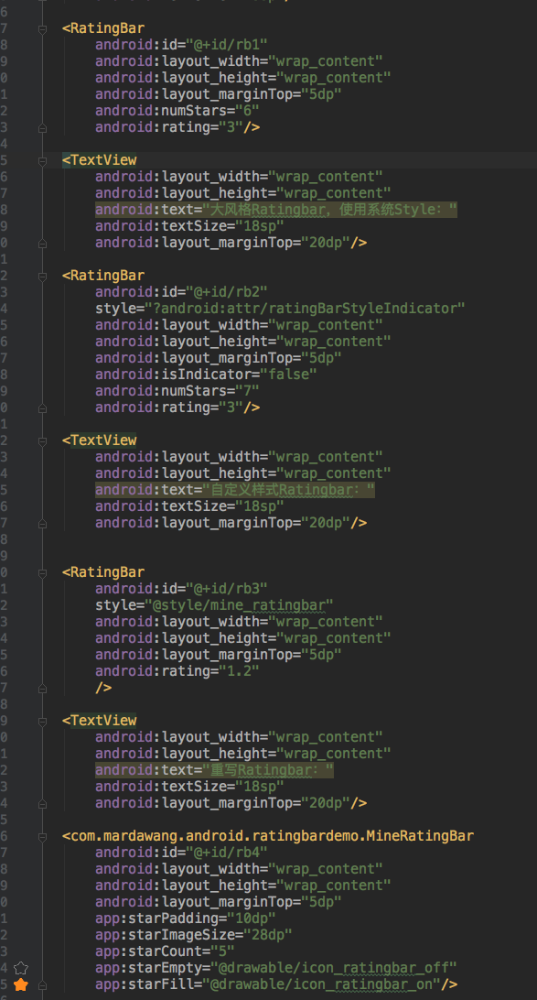
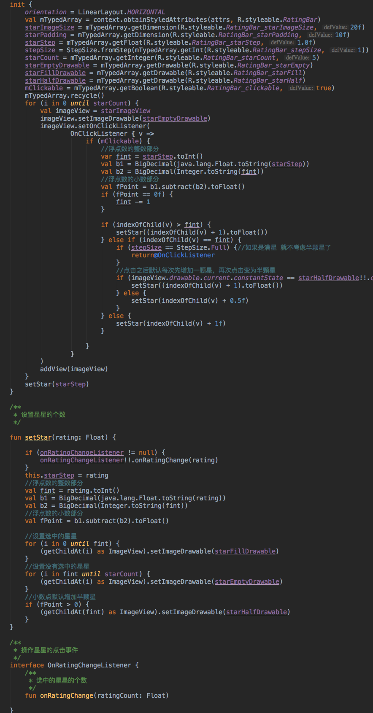

# RatingbarDemo

RatingBar是基于SeekBar（拖动条）和ProgressBar（状态条）的扩展，用星形来显示等级评定！

该项目就是一个使用Kotlin语言编写的针对ratingbar做了改造的项目(主要包含四种方式：两种系统默认方式，一种自定义style样式，一种重写ratingbar样式);

## 背景
#### 1.由于开发过程中，遇到了需要对客户评分并展示的需求，由于需求较为复杂，不适用于直接使用系统自带的ratingbar，所以只好自定义。

#### 2.之前不曾遇到过这样的需求，也没有操作过。

#### 3.在项目中使用Kotlin编码较少，这次纯粹当作练手。

下面是效果图，

下面是部分核心代码

-------------------------------------------------------

如果对你有那么一丝的帮助，请不要吝啬。求star！求star！求star！求star！求star！

If you like this library's design, feel it help to you, you can point the upper right corner "Star" support Thank you! ^ _ ^

